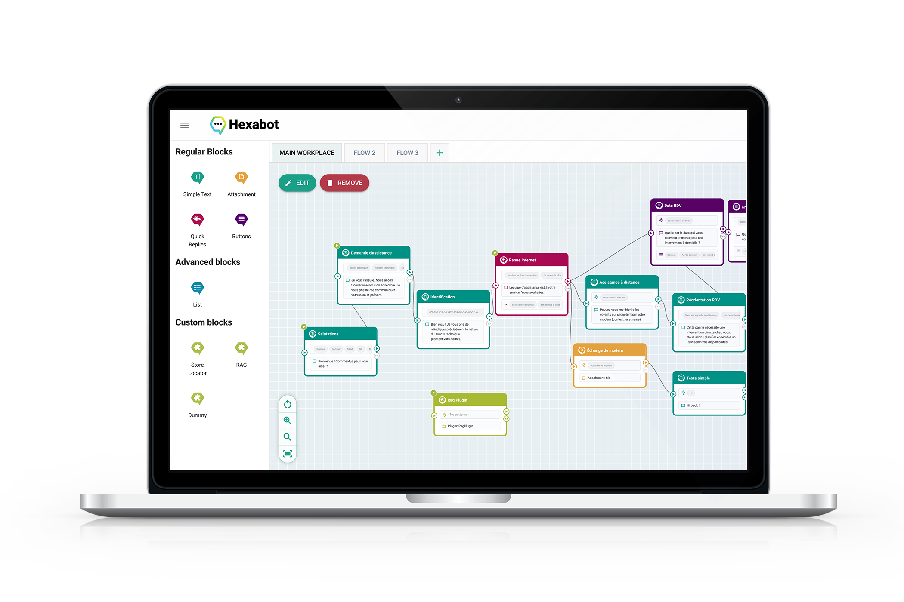

# Welcome

Welcome to the Hexabot Documentation! Hexabot is a powerful and versatile open-source chatbot platform designed to simplify the creation and management of intelligent conversational chatbots. Whether you're a business owner seeking to automate customer interactions, an organization looking to engage your audience, or a developer wanting to integrate conversational AI into your applications, Hexabot provides the tools and flexibility you need.

<figure><figcaption>
A preview of Hexabot visual editor
</figcaption></figure>

## Key Features

Hexabot comes equipped with a comprehensive suite of features to empower your chatbot development:

* **Intuitive Visual Editor:** Build complex conversation flows without coding using our drag-and-drop interface and a diverse library of pre-built blocks.
* **NLU Engine:** Leverage state-of-the-art NLP technology to understand user intent, extract key information, and deliver personalized responses.
* **Flexible Deployment Options:** Deploy your chatbots on various platforms, including Facebook Messenger, web widgets, and custom integrations.
* **Comprehensive Analytics and Reporting:** Track key metrics, monitor chatbot performance, and gain valuable insights into user interactions.
* **And More:** Discover a range of additional features, including user segmentation, content management, and third-party integrations.

## Who Should Use This Documentation

This documentation is a valuable resource for:

* **New Users:** Get started with Hexabot, learn the basics of chatbot creation, and build your first conversational chatbot.
* Experienced Users: Explore advanced features, optimize your existing chatbots, and discover best practices for chatbot development.
* Developers: Integrate Hexabot with your applications, leverage our APIs, and extend the platform's functionality by developing add-ons for Hexabot.
* Administrators: Manage users, configure settings, and ensure the smooth operation of Hexabot within your organization.

## How to Use This Documentation

To navigate this documentation effectively:

* Search: Use the search bar to quickly find information on specific topics or keywords.
* Navigation: Browse through the table of contents to explore different sections and find the information you need.
* Links: Follow links to related articles and resources for in-depth explanations and examples.

Feedback: We encourage you to provide feedback and suggestions for improvement. Your input helps us make this documentation even better.

## Contacting Support

If you encounter any issues or have questions not addressed in this documentation, our dedicated support team is here to assist you. Please contact us at [hello@hexabot.ai](mailto:hello@hexabot.ai)

### Jump right in

<table data-view="cards"><thead><tr><th></th><th></th><th data-hidden data-card-cover data-type="files"></th><th data-hidden></th><th data-hidden data-card-target data-type="content-ref"></th></tr></thead><tbody><tr><td><strong>Getting Started</strong></td><td>Install Hexabot and create your first flow</td><td><a href=".gitbook/assets/1.png">1.png</a></td><td></td><td><a href="broken-reference">Broken link</a></td></tr><tr><td><strong>Product overview</strong></td><td>Key Features and Capabilities</td><td><a href=".gitbook/assets/4.png">4.png</a></td><td></td><td><a href="broken-reference">Broken link</a></td></tr><tr><td><strong>User Guide</strong></td><td>Learn the basics of Hexabot</td><td><a href=".gitbook/assets/2.png">2.png</a></td><td></td><td><a href="broken-reference">Broken link</a></td></tr><tr><td><strong>Developer Guide</strong></td><td>Learn how to develop for Hexabot</td><td><a href=".gitbook/assets/3.png">3.png</a></td><td></td><td><a href="broken-reference">Broken link</a></td></tr><tr><td><strong>Key Concepts</strong></td><td>Understanding the Fundamentals of Chatbot Building</td><td><a href=".gitbook/assets/3.png">3.png</a></td><td></td><td><a href="broken-reference">Broken link</a></td></tr></tbody></table>

