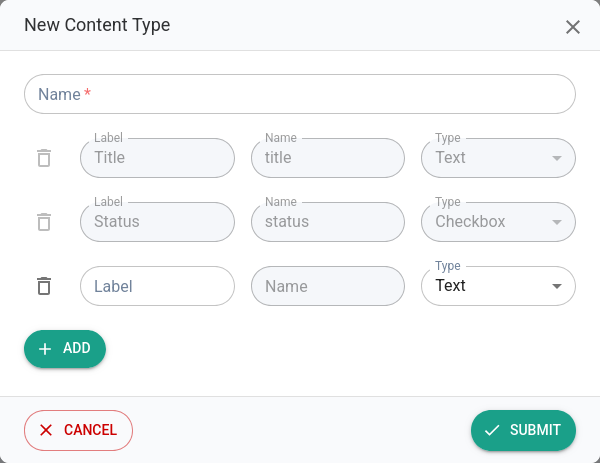

# Extensions

Hexabot supports **extensions**, which are modular pieces of code that add new capabilities, features, or integrations to your Hexabot instance. Extensions allow you to customize and enhance your Conversational AI by adding functionality beyond the default setup. They can be categorized into three main types: Channels, Plugins, and Helpers.

### How to Install an Extension in Hexabot

Hexabot makes it easy to extend its capabilities by installing extensions. Follow this guide to browse, select, and install the extensions you need.

#### Steps to Install an Extension

1. **Visit the Extension Catalog**

Start by visiting [hexabot.ai/extensions](https://hexabot.ai/extensions), where you can explore a wide variety of community-published extensions. Browse through the available channels, plugins, and helpers to find the one that fits your needs.

2. **Set Up Your Project**

If you haven’t already created a Hexabot project, you can do so using the Hexabot CLI:

```bash
hexabot create myproject
cd myproject/
```

This will generate the base structure for your chatbot project.

3. **Install the Extension**

Extensions are published as NPM packages. To install an extension, run the following command in your project directory:

```bash
npm i --save hexabot-[channel|plugin|helper]-NAME
```

• Replace `[channel|plugin|helper]` with the appropriate type of extension.

• Replace NAME with the specific name of the extension you want to install.

For example, to install a plugin for integrating with an external API, the command might look like this:

```bash
npm i --save hexabot-plugin-ollama
```

4. **Read the Extension’s Documentation**

Each extension comes with its own documentation that provides detailed usage instructions. Make sure to carefully read and follow the instructions to configure and use the extension effectively.

Extensions are published as <mark style="background-color:yellow;">NPM packages</mark>. Some extensions may depend on other extensions to function correctly. For example:

• A plugin may require a specific helper to operate.

• A channel might rely on a helper for authentication or data handling.

When installing an extension, review its documentation to identify any dependencies and install them as needed.

Extensions published on [hexabot.ai/extensions](https://hexabot.ai/extensions) are reviewed by the Hexabot team and community members to ensure quality and functionality. While we strive to maintain high standards, always test extensions in your environment to ensure they meet your requirements.

### Types of Extensions

#### Channels&#x20;

A **channel** enables your AI bot to be accessible through various mediums, making it available to interact with users via different platforms or devices. Channels extend the reach of your bot to:

* Chat apps (e.g., Slack, WhatsApp, Telegram)
* Social media platforms (e.g., Facebook Messenger, Twitter)
* Websites or web apps (via embedded chat widgets)
* IoT devices (e.g., voice assistants, smart appliances)
* Etc.

Essentially, channels allow your agent to communicate in diverse environments, ensuring seamless accessibility for end-users.

#### .png>)Plugins

**Plugins** add new features and capabilities directly to the conversational AI system. The primary type of plugin currently available is the "**Block Plugin**", which allows you to introduce custom blocks in the visual editor. These blocks:

* Enable new actions and integrations in conversation flows.
* Are fully visible to end-users building flows in the visual editor.
* Expand the creative possibilities of what your AI agent can do.

For example, you can create a custom plugin to integrate your chatbot with an external API or trigger specific workflows.

#### .png>)Helpers

**Helpers** are essential services or utilities that operate in the background to support the functionality of plugins. While they are not exposed to end-users building conversation flows, they play a critical role in ensuring plugins work as intended.

For example:

* A plugin for API integration may require a helper to handle communication with a 3rd Party API.
* A plugin that retrieves data from a database may depend on a helper to manage queries.

Some plugins may require one or more helpers to function. It is crucial to install the necessary helpers for the plugins you plan to use.

### Building Your Own Extensions

Hexabot encourages users to create their own extensions to further customize their chatbot’s functionality. You can share your extensions with the community to help others benefit from your work.

Visit [hexabot.ai/extensions](https://hexabot.ai/extensions) to explore the liibrary of extensions available for installation and reuse.

If you’re a developer, you can contribute to this growing ecosystem by building and publishing your own extensions to the catalog. Extend Hexabot and help shape the future of conversational AI!

