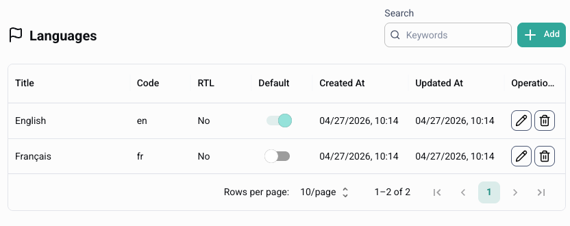

# Languages

Use **Languages** to define which languages your workspace supports.

Hexabot can serve users in their preferred language when it is available. If no language is detected, Hexabot uses the default language.

<figure><figcaption></figcaption></figure>

### What you manage here

In this page, you can:

* Add supported languages for your workflows
* Choose the default fallback language
* Enable right-to-left layout for languages like Arabic

### Add a language

1. Open **Localization** → **Languages**.
2. Click **Add Language**.
3. Enter:
   * **Title** — the language name, such as English or French
   * **Code** — the language code, such as `en`, `fr`, or `ar`
   * **RTL** — enable this for right-to-left languages
4. Click **Save**.

### Update a language

1. Open **Localization** → **Languages**.
2. Select the language you want to edit.
3. Update the **Title**, **Code**, or **RTL** setting.
4. Click **Save**.

### Set the default language

The default language is used when no user language is available.

1. Open **Localization** → **Languages**.
2. Select the language you want to use as default.
3. Save your changes.

### Delete a language

1. Open **Localization** → **Languages**.
2. Click the delete icon next to the language.
3. Confirm the deletion.


Deleting a language also removes its translations. You must keep at least one language in the workspace.


### Related page

Use [Translations](translations.md) to manage user-facing text for each supported language.
