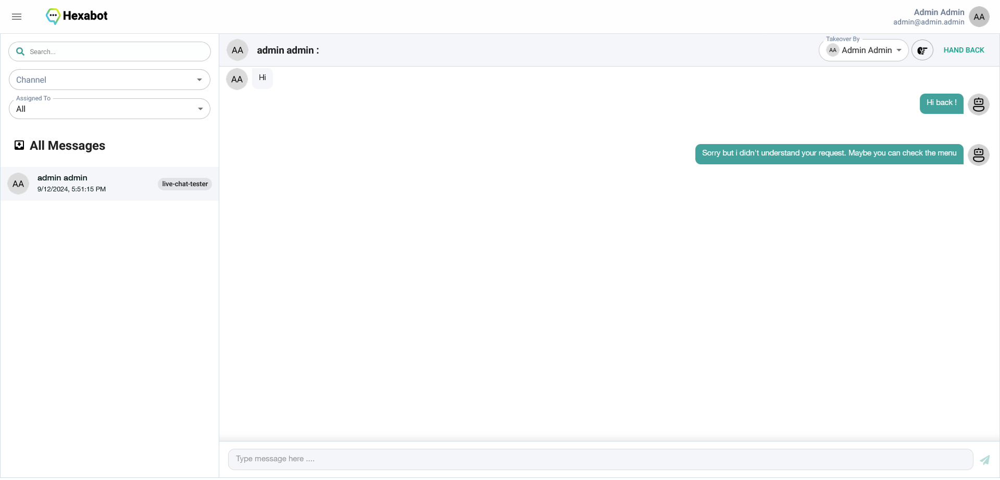

# Chat Inbox

The Chat Inbox in Hexabot is your central hub for monitoring all conversations between your chatbot and users. This comprehensive view allows you to track interactions, review past conversations, and intervene in real-time when necessary.

<figure><figcaption></figcaption></figure>

**1. Accessing the Chat Inbox:**

* Find the "Inbox" section in the main menu .

**2. Understanding the Inbox View:**

* **Conversation List:** The inbox displays a list of all recent and past conversations. Each conversation is typically listed with:
  * **User Name/ID:** The name or identifier of the user who is interacting with the chatbot.
  * **Channel:** The platform where the conversation is happening (e.g., "live-chat-tester," "Facebook Messenger," or your website chat widget).
  * **Last Message Timestamp:** The date and time of the last message in the conversation.
* **Search Bar:** Use the search bar at the top to quickly find a specific conversation by typing a keyword or phrase from the user's message.
* **Filter Options (Optional):** Hexabot might offer additional filter options, such as:
  * **Channel:** Filter conversations by specific communication channels.
  * **Assigned To:** Filter conversations based on the user who is currently handling them.

**3. Reviewing Conversations:**

* **Open a Conversation:** Click on a conversation in the list to view the complete exchange of messages between the chatbot and the user.
* **Conversation History:** The conversation will be displayed in a chronological order, showing all messages sent and received.
* **User and Chatbot Messages:** You can easily distinguish between user messages (typically displayed in a different color or style) and chatbot responses.

**4. Intervening in Conversations:**

* **Take Over:** If you need to manually intervene in a conversation, Hexabot might offer a "Take Over" or "Live Chat" option. This allows you to:
  * **Take Control:** Take over the chatbot's conversation and respond directly to the user.
  * **Human Agent Response:** When a chatbot encounters an issue, is unable to understand a user's query, or needs to handle a complex situation, a human agent can take over to provide assistance.
  * **Switching Back to Automatic Mode:** You may also be able to switch back to the automatic chatbot mode after handling a user's request by clicking on "HAND BACK" button.

**5. Assign conversation to a specific agent:**

The inbox interface allows you also to assign a conversation to a specific user, for instance, if you have a team handling different aspects of customer support.
