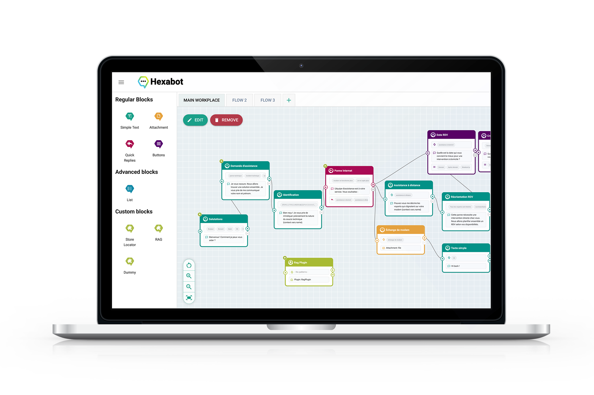

# Visual Editor

<figure><figcaption></figcaption></figure>

The visual editor in Hexabot simplifies chatbot creation and optimization through its core feature: the **block palette**. This palette acts as an essential menu, granting control over and configuration of the chatbot's conversational flow. In essence, it provides users with a set of tools in the form of blocks, each designed to perform specific tasks in building the dialogue between the chatbot and its users.

**Blocks are the fundamental building blocks of any chatbot** and play a central role in creating the conversation flow. They define how the chatbot interacts with users and responds to their various requests. Using blocks, you can design the conversational path intuitively, **without requiring any programming skills**. Each block is designed to fulfill a particular function and can be easily integrated into the overall dialogue flow.

In practice, blocks enable you to create a structured chain of responses and interactions between the chatbot and the user. For example, some blocks can be configured to send text messages, while others can be used to capture user responses, such as choices or specific data. Other blocks can be configured to integrate external services or APIs, allowing the chatbot to connect to third-party systems and enrich interactions with additional data.

To build the conversational path, you can add blocks to the design canvas and connect them. This connectivity is crucial as it determines the sequence in which interactions occur. It allows you to create complex conversation scenarios by defining precise rules for each block and linking them logically. For example, a message block could be followed by a user input block, then a decision block that steers the conversation based on the user's responses.

Each block has a specific type that determines its role and capabilities in the conversational flow. For instance, a message block will send a predefined text, while an input capture block will allow the chatbot to gather information from the user, such as answers to questions or choices from multiple options. Additionally, integration blocks can be used to interact with external services, such as a 3rd party API, an e-commerce website or a billing system, enabling the chatbot to provide more personalized and relevant responses.
